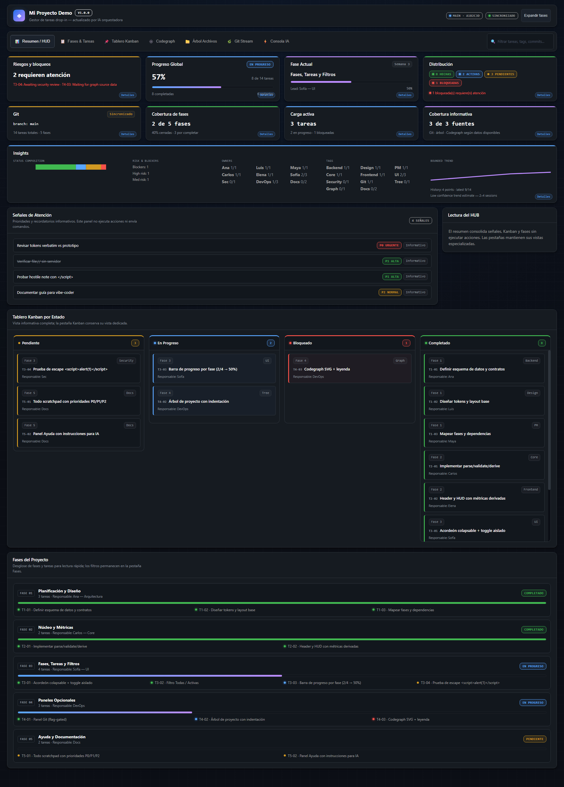
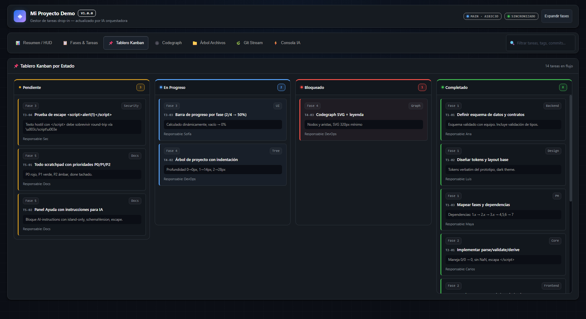
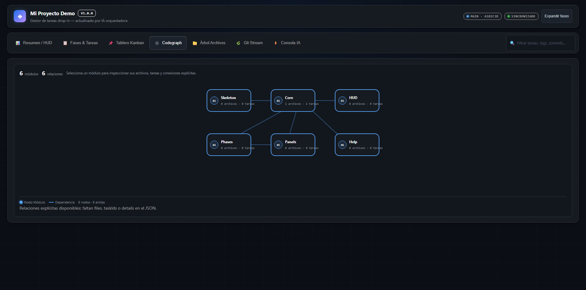
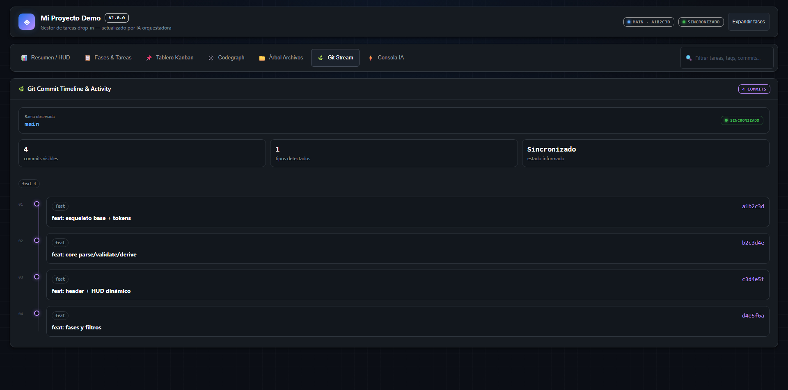
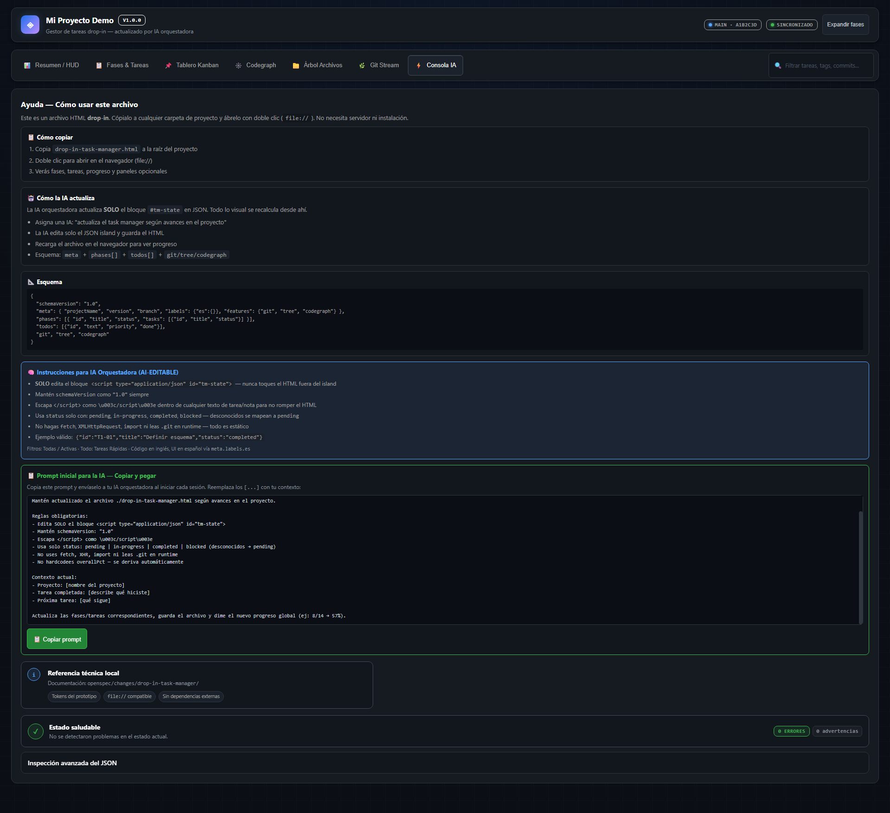

# Task Manager Portable

> Un dashboard de proyectos en **un solo archivo HTML**, completamente offline, sin instalación, sin servidor y sin dependencias de runtime.

<p align="center">
  <a href="./Task-Manager-Portable.html"><strong>Abrir el archivo portátil</strong></a>
  ·
  <a href="./docs/USAGE.md">Guía de uso</a>
  ·
  <a href="./docs/CUSTOMIZATION.md">Personalización</a>
  ·
  <a href="./docs/AI-ORCHESTRATOR-GUIDE.md">Integración con IA</a>
</p>



## Qué es

Task Manager Portable convierte el estado de un proyecto en un cockpit visual que vive junto al código. Basta con copiar `Task-Manager-Portable.html` dentro de cualquier carpeta, abrirlo con doble clic y actualizar su bloque JSON interno.

| Característica | Resultado |
|---|---|
| Distribución | Un único archivo HTML autocontenido |
| Instalación | Ninguna |
| Servidor | No requerido |
| Conectividad | Funciona offline mediante `file://` |
| Datos | Un bloque JSON `#tm-state` |
| Dependencias runtime | Cero |
| Compatibilidad | Chrome, Edge, Firefox y Safari modernos |

## Inicio rápido

1. Descarga [`Task-Manager-Portable.html`](./Task-Manager-Portable.html).
2. Copia el archivo dentro de tu proyecto.
3. Ábrelo con doble clic.
4. Personaliza el bloque `<script type="application/json" id="tm-state">` o pide a tu asistente de IA que lo mantenga actualizado.

```text
mi-proyecto/
├── src/
├── README.md
└── Task-Manager-Portable.html  ← abrir con doble clic
```

> El navegador no permite que un archivo `file://` inspeccione automáticamente la carpeta donde está ubicado. La información se proporciona mediante el JSON embebido para preservar seguridad y portabilidad.

## Recorrido visual

### 1. Resumen ejecutivo

El HUD reúne progreso global, riesgos, distribución, fase actual, Git, cobertura e insights. Cada recuadro es accesible por teclado y abre una ventana centrada con su desglose.


### 2. Fases y tareas

Consulta el proyecto por fases, filtra por texto, estado, responsable, etiqueta o fase y expande únicamente la información necesaria.


### 3. Tablero Kanban

Visualiza las tareas en columnas de pendiente, en progreso, bloqueado y completado sin modificar el estado desde la interfaz.



### 4. Codegraph

Representa módulos y relaciones explícitas. Los nodos pueden abrirse para consultar archivos, tareas y conexiones disponibles.



### 5. Estructura del repositorio

Documenta carpetas, archivos, profundidad y blueprint general del proyecto mediante datos declarativos.


### 6. Actividad Git

Presenta rama, sincronización y commits declarados en una línea temporal legible. El HTML nunca accede directamente a `.git`.



### 7. Consola IA

Incluye instrucciones de uso, prompt inicial para asistentes, estado de salud, inspección avanzada y exportación del JSON.



## Cómo funciona

Todo el contenido visual se deriva de una única fuente de verdad:

```html
<script type="application/json" id="tm-state">
{
  "schemaVersion": "1.0",
  "meta": { "projectName": "Mi proyecto", "version": "1.0.0" },
  "phases": [],
  "todos": [],
  "git": {},
  "tree": [],
  "codegraph": {}
}
</script>
```

La aplicación valida el estado y deriva automáticamente:

- progreso global y por fase;
- distribución por estado;
- carga activa, riesgos y bloqueos;
- Kanban y desglose de tareas;
- paneles Git, Tree y Codegraph;
- diagnósticos y advertencias.

Consulta [Personalización](docs/CUSTOMIZATION.md) para el esquema completo y ejemplos.

## Integración con asistentes de IA

Puedes usar este prompt con OpenCode, Claude, Codex, Cursor u otro asistente:

```text
Mantén actualizado ./Task-Manager-Portable.html según los avances del proyecto.

Reglas:
- Edita únicamente el contenido del bloque JSON con id="tm-state".
- Conserva schemaVersion "1.0".
- Usa status: pending, in-progress, completed o blocked.
- Escapa </script> como \u003c/script\u003e dentro de cualquier texto.
- No añadas fetch, imports, scripts externos ni dependencias runtime.
- No modifiques el HTML, CSS o JavaScript fuera del bloque JSON.
```

La guía completa está en [`docs/AI-ORCHESTRATOR-GUIDE.md`](docs/AI-ORCHESTRATOR-GUIDE.md).

## Estructura del repositorio

```text
task-manager-portable/
├── Task-Manager-Portable.html   # único archivo ejecutable (abrir con doble clic)
├── modules/                     # HTML, CSS y JavaScript modulares fuente
├── scripts/                     # ensamblador (assemble) y scanner de portabilidad
├── tests/                       # pruebas unitarias y validación browser e2e
├── docs/                        # documentación técnica y capturas
│   ├── image/
│   ├── USAGE.md
│   ├── CUSTOMIZATION.md
│   ├── ARCHITECTURE.md
│   ├── DEVELOPMENT.md
│   └── AI-ORCHESTRATOR-GUIDE.md
├── .github/                     # CI y plantillas de colaboración
├── CHANGELOG.md
├── CONTRIBUTING.md
├── SECURITY.md
└── LICENSE
```

## Desarrollo

El archivo distribuible no necesita Node.js. Node se usa únicamente para desarrollar y verificar el proyecto.

```bash
npm install
npm test
npm run check
npm run assemble
npm run test:browser
node scripts/scan-portability.mjs
```

Estado de la versión publicada:

- **131/131** pruebas Node aprobadas;
- **1/1** recorrido Playwright aprobado;
- verificación TypeScript aprobada;
- scanner `file://` aprobado;
- cero dependencias runtime.

Más información: [`docs/DEVELOPMENT.md`](docs/DEVELOPMENT.md) y [`docs/ARCHITECTURE.md`](docs/ARCHITECTURE.md).

## Limitaciones conocidas

- No inspecciona automáticamente archivos, Git o Codegraph por restricciones de seguridad de `file://`.
- Los datos mostrados son snapshots declarados en `#tm-state`.
- El panel es informativo y de solo lectura; no ejecuta comandos ni cambia tareas.
- Para actualizar el contenido, edita el JSON manualmente o mediante un asistente.

## Contribuir

Las contribuciones son bienvenidas. Antes de abrir un pull request, lee [`CONTRIBUTING.md`](CONTRIBUTING.md) y ejecuta todas las verificaciones.

## Seguridad

No publiques secretos, tokens ni datos sensibles dentro del JSON: el HTML puede compartirse como cualquier otro archivo. Consulta [`SECURITY.md`](SECURITY.md).

## Licencia

Distribuido bajo la licencia [MIT](LICENSE).

---

Creado por [RamonsDka](https://github.com/RamonsDka) para equipos y creadores que necesitan visibilidad de proyecto sin introducir otra plataforma, servidor o cuenta.
